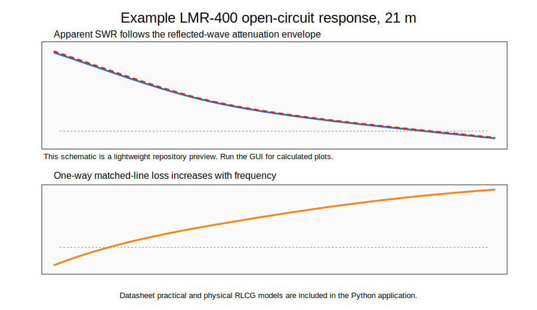

# LMR-400 Long-Line SWR Visualizer

A small Python GUI for visualizing the apparent SWR seen by a 50-ohm antenna analyzer when measuring a long length of LMR-400 coaxial cable with an open, shorted, or custom termination.

The motivating observation is that a long open-ended feedline may not appear as an infinite SWR at the analyzer. The open-circuit reflection still occurs at the far end, but the reflected wave is attenuated on both the outbound and return trips. The analyzer therefore sees a reduced reflection coefficient and may report a moderate or deceptively low SWR even though the far end is disconnected.



## What the program shows

The visualizer separates two related effects that are easy to conflate:

1. **Apparent SWR suppression by feedline loss.**  
   For an ideal open or short on a nominal 50-ohm line, the reflection-coefficient magnitude at the analyzer is primarily controlled by round-trip attenuation.

2. **Electrical-length impedance rotation.**  
   The transformed input impedance and reflection phase vary periodically with frequency. For a clean matched-line model, this phase rotation does not necessarily imply large periodic swings in SWR magnitude.

The GUI includes two modeling approaches:

- **Datasheet practical model** — uses typical LMR-400 attenuation behavior and velocity factor. This is the recommended mode for practical radio-club demonstrations and rough comparison to analyzer observations.
- **Physical RLCG model** — uses the lossy telegrapher-equation model from distributed resistance, inductance, conductance, and capacitance. This is useful for exploring mechanisms, low-frequency behavior, and extrapolated behavior, but the conductor/shield loss model is approximate.

## Quick start for Windows users

### Option 1: Download a release executable

For club members who do not want to install Python, download the `.exe` file from the repository's **Releases** page.

On Windows, SmartScreen may warn about unsigned executables from small open-source projects. Choose **More info** and **Run anyway** only if you trust the source of the file.

### Option 2: Run from Python

Install Python 3.10 or newer, then open PowerShell or Command Prompt in this folder and run:

```bash
pip install -r requirements.txt
python lmr400_long_line_swr_visualizer.py
```

You can also double-click `run_windows.bat` after Python and the requirements are installed.

## Building a Windows executable locally

Install the development requirements:

```bash
pip install -r requirements-dev.txt
```

Then run:

```bash
pyinstaller --onefile --windowed --name LMR400_Long_Line_SWR_Visualizer lmr400_long_line_swr_visualizer.py
```

or double-click:

```text
build_windows_exe.bat
```

The executable will be created under `dist/`.

## GitHub release workflow

This repository includes a GitHub Actions workflow at:

```text
.github/workflows/build-windows.yml
```

When you push a version tag such as `v0.1.0`, GitHub Actions will build the Windows executable and upload it as a release asset.

Example:

```bash
git tag v0.1.0
git push origin v0.1.0
```

## Technical note

A short explanatory write-up is included here:

```text
docs/technical_note.md
```

Core relationship for a nominally matched line:

```math
\Gamma_\mathrm{in} = \Gamma_L e^{-2\alpha l}
```

For an open termination, 
```math
\Gamma_L = +1\, 
```

So:
```math
|\Gamma_\mathrm{in}| \approx e^{-2\alpha l}
```

When one-way matched-line loss is expressed in dB:

```math
|\Gamma_\mathrm{in}| \approx 10^{-L_\mathrm{one-way,dB}/10}
```

and the apparent SWR is:

```math
\mathrm{SWR} = \frac{1 + |\Gamma_\mathrm{in}|}{1 - |\Gamma_\mathrm{in}|}
```

## Practical caution

A low SWR measured at the transmitter end of a long lossy feedline does **not** prove that the antenna terminals are well matched. The feedline may simply be attenuating the reflected wave before it returns to the analyzer.

## Repository layout

```text
lmr400-long-line-swr-visualizer/
├── lmr400_long_line_swr_visualizer.py
├── README.md
├── LICENSE
├── requirements.txt
├── requirements-dev.txt
├── run_windows.bat
├── build_windows_exe.bat
├── docs/
│   ├── technical_note.md
│   └── release_instructions.md
├── examples/
│   └── example_21m_open_response.svg
└── .github/
    └── workflows/
        └── build-windows.yml
```

## Model limitations

- LMR-400 datasheet-style estimates are most meaningful over the manufacturer's specified frequency range.
- The GUI allows wider exploratory sweeps, but those should be treated as extrapolations rather than validated LMR-400 predictions.
- Connector quality, water ingress, corrosion, shield damage, adapters, analyzer calibration, and imperfect opens/shorts can all change real analyzer readings.
- The physical RLCG model is intentionally educational; the exact high-frequency loss of real coax depends on geometry, braid/shield construction, plating, roughness, dielectric behavior, and manufacturing details.

## License

MIT License. See `LICENSE`.
